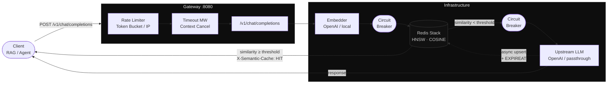

# Semantic Cache Gateway

> An OpenAI-compatible semantic caching proxy for RAG pipelines — intercepts LLM requests, matches semantically equivalent queries via Redis Vector Similarity Search, and returns cached responses with sub-10ms latency.


---

## The Concept

RAG pipelines repeatedly ask the same questions with slightly different phrasings — _"What is the refund policy?"_ and _"How do I get a refund?"_ are semantically identical but lexically distinct. The gateway sits between your application and the LLM provider: every incoming request is embedded into a dense vector, compared against a Redis Stack HNSW index via cosine similarity, and if a sufficiently similar prior answer exists (configurable threshold, default `0.92`), it is returned immediately — no LLM call, no billing, no latency. On a cache miss the upstream call is proxied normally, the response is persisted asynchronously alongside its embedding, and the entry's TTL is renewed on each subsequent hit.

---

## Architecture



---

## Core Features

- **Clean Architecture** — domain ports are pure interfaces; infrastructure adapters (Redis, Qdrant, OpenAI) are fully interchangeable without touching business logic
- **Redis Stack VSS with Dynamic TTL** — HNSW index over COSINE distance, little-endian `float32` binary encoding; every cache hit triggers a background `EXPIRE` refresh, keeping hot entries alive and cold entries auto-evicted
- **Circuit Breaker & Fallback** — `sony/gobreaker` decorators wrap LLM and vector store adapters; a tripped vector store circuit transparently falls back to the LLM, a tripped LLM circuit returns `503` immediately — no cascading failures
- **Native Observability** — Prometheus metrics (`scg_semantic_cache_hits_total`, `scg_llm_request_duration_seconds`, `scg_circuit_breaker_trips_total{component}`), structured JSON logging via `log/slog`, all at `/metrics`
- **Drop-in OpenAI Replacement** — `POST /v1/chat/completions` accepts the standard request shape; change only the `base_url` in your existing client

---

## Quick Start

```bash
git clone https://github.com/Guilherme-Ciano/semantic-cache-gateway.git
cd semantic-cache-gateway

cp .env.example .env
# Set SCG_LLM_API_KEY and SCG_EMBEDDER_API_KEY in .env

docker compose up -d
```

Services started:

| Service     | Port   | Purpose                       |
| ----------- | ------ | ----------------------------- |
| gateway     | `8080` | API + `/metrics` + `/healthz` |
| redis-stack | `6379` | Vector store + cache          |
| prometheus  | `9090` | Metrics scraping              |

```bash
# Verify
curl http://localhost:8080/healthz
# {"status":"ok"}
```

---

## Usage

### Request

```bash
curl -si -X POST http://localhost:8080/v1/chat/completions \
  -H "Content-Type: application/json" \
  -d '{
    "model": "gpt-4o-mini",
    "messages": [
      { "role": "user", "content": "What is retrieval-augmented generation?" }
    ]
  }'
```

### Response — Cache MISS (first call, ~400ms)

```
HTTP/1.1 200 OK
Content-Type: application/json
X-Cache: MISS
X-Semantic-Cache: MISS
X-Cache-Entry-Id: 550e8400-e29b-41d4-a716-446655440000
X-Request-Latency-Ms: 412
```

```json
{
  "id": "scg-1727912034000000000",
  "object": "chat.completion",
  "created": 1727912034,
  "model": "gpt-4o-mini",
  "choices": [
    {
      "index": 0,
      "message": {
        "role": "assistant",
        "content": "Retrieval-Augmented Generation (RAG) is an AI architecture that combines..."
      },
      "finish_reason": "stop"
    }
  ]
}
```

### Response — Cache HIT (semantically equivalent query, ~8ms)

```bash
# Semantically equivalent — different phrasing, same intent
curl -si -X POST http://localhost:8080/v1/chat/completions \
  -H "Content-Type: application/json" \
  -d '{
    "model": "gpt-4o-mini",
    "messages": [
      { "role": "user", "content": "Can you explain what RAG stands for in AI?" }
    ]
  }'
```

```
HTTP/1.1 200 OK
Content-Type: application/json
X-Cache: HIT
X-Semantic-Cache: HIT
X-Cache-Entry-Id: 550e8400-e29b-41d4-a716-446655440000
X-Similarity-Score: 0.9742
X-Cache-Score: 0.9742
X-Request-Latency-Ms: 8
```

> **Agent instrumentation** — autonomous agents and orchestration frameworks (LangChain, AutoGen, CrewAI) can read `X-Semantic-Cache`, `X-Similarity-Score`, and `X-Request-Latency-Ms` to decide whether to re-query with a lower threshold, log cache efficiency, or trigger active invalidation.

---

## Configuration

The gateway is configured by three overlapping sources (lowest → highest precedence):

```
defaults → config.yaml → environment variables (SCG_*)
```

```bash
# Start with a custom config file
gateway --config /etc/scg/config.yaml

# Override individual values
gateway --addr :9000 --threshold 0.88 --log-level debug

# 100% environment-driven (CI/CD, Kubernetes)
SCG_LLM_API_KEY=sk-...          \
SCG_EMBEDDER_API_KEY=sk-...     \
SCG_VECTORDB_PROVIDER=redis-stack \
SCG_SERVER_ADDR=:8080           \
gateway
```

### Key environment variables

| Variable                                    | Default       | Description                          |
| ------------------------------------------- | ------------- | ------------------------------------ |
| `SCG_LLM_API_KEY`                           | —             | OpenAI / compatible API key          |
| `SCG_EMBEDDER_API_KEY`                      | —             | Embedding model API key              |
| `SCG_CACHE_SIMILARITY_THRESHOLD`            | `0.92`        | Minimum cosine similarity for a HIT  |
| `SCG_VECTORDB_PROVIDER`                     | `redis-stack` | `redis-stack` \| `qdrant` \| `redis` |
| `SCG_CIRCUIT_BREAKER_LLM_FAILURE_THRESHOLD` | `5`           | Consecutive LLM failures before open |
| `SCG_SERVER_RATE_LIMIT_RPS`                 | `10`          | Sustained requests/s per IP          |

Full reference: [`config.example.yaml`](config.example.yaml)

---

## Development

```bash
make test           # go test -race -count=1 ./...
make test-coverage  # generates coverage.html
make lint           # golangci-lint
make build          # bin/gateway (static, CGO_ENABLED=0)
make help           # all targets
```

---

## Roadmap

- **[SSE Streaming]** Intercept LLM stream chunks, compose the full response in-flight for Redis persistence, and forward `text/event-stream` to the client without buffering delay
- **[Multi-Tenancy]** Namespace-scoped Redis indexes (`tenant:<id>:idx`) for context isolation in multi-agent and multi-pipeline deployments
- **[Cache Invalidation Webhook]** `DELETE /v1/cache/invalidate` endpoint accepting vector-space queries or explicit entry IDs to purge stale embeddings when the knowledge base changes

---

## License

MIT — see [LICENSE](LICENSE).
